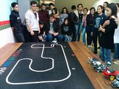
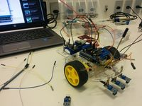
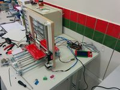
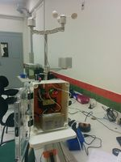

# Projetos LabMaker

Projetos LabMaker
=================

Projetos "guarda-chuva" registrados no COPE
-------------------------------------------

[IF Things – Pesquisa e Desenvolvimento de aplicações para Internet das Coisas](/wiki/index.php/IF_Things_%E2%80%93_Pesquisa_e_Desenvolvimento_de_aplica%C3%A7%C3%B5es_para_Internet_das_Coisas "IF Things – Pesquisa e Desenvolvimento de aplicações para Internet das Coisas")
:   Projeto de Pesquisa 2020/2021. Coordenadora: Juliana Hoffmann Quinonez Benacchio. Vice-Coordenadora: Marcela Turim Koschevic. Colaborador: Humberto Martins Beneduzzi

[Hardware e Redes de Comunicação para Internet das Coisas](/wiki/index.php/Estudos_sobre_IoT "Estudos sobre IoT")
:   Pós-Doutorado 2020. Professor Evandro Cantú

Projetos e ações em andamento
-----------------------------

Equipes de Robótica
-------------------

 

[Robótica](/wiki/index.php/Rob%C3%B3tica "Robótica")
:   Tem como objetivo orientar equipes de alunos para participar das **Olimpíada de Robótica do IFPR**.

Projetos Realizados no LabMaker
-------------------------------

Extrusor para fazer filamento
:   O projeto terá como objetivo construir um extrusor para fazer filamento plástico para impressoras 3D.

    * Projeto PRADI e PIBIT-FA 2018/2019. Bolsista: Renan A. Chiapetti e Micheli T. Moura. Coordenadores: Vasco Neves e Alcione Benacchio.

Desenvolvimento de Sistemas para Monitoramento e Controle do Uso da Energia Elétrica
:   O objetivo deste projeto é o desenvolvimento de sistemas para monitoramento e controle do uso da energia elétrica.

    * Projeto PIBIC-Jr 2018/2019: Bolsista: João Victor Castro.
:   Este projeto inclui os seguintes subprojetos:

    * [Medição da Energia Elétrica de um Gerador Eólico](/wiki/index.php/Medi%C3%A7%C3%A3o_da_Energia_El%C3%A9trica_de_um_Gerador_E%C3%B3lico "Medição da Energia Elétrica de um Gerador Eólico"): Tem como objetivo medir a energia elétrica gerada por um gerador eólico utilizando o Arduíno.
    * [Medição da Energia Elétrica em Ponto de Consumo](/wiki/index.php?title=Medi%C3%A7%C3%A3o_da_Energia_El%C3%A9trica_em_Ponto_de_Consumo&action=edit&redlink=1 "Medição da Energia Elétrica em Ponto de Consumo (página inexistente)"): O projeto terá como objetivo criar um dispositivo capaz de medir a energia elétrica consumida em um ponto de consumo.

[Seguidor de Linha com controle PID](/wiki/index.php/Seguidor_de_Linha_com_controle_PID "Seguidor de Linha com controle PID")
:   Este projeto terá como objetivo construir e analisar o funcionamento de um **robô seguidor de linha** com **Controle Proporcional Integral Derivativo** (**PID**).

    * TCC Licenciatura em Física. Estudante: Juliana Souza. Orientador: Evandro Cantú

Aplicativo para monitoramento de sistema de captação de água da chuva
:   O projeto terá como objetivo desenvolver um aplicativo para monitoramento de um sistema de captação de água da chuva..

    * Projeto PIBIS 2018. Bolsista; Nathaly Moraes de Oliveira. Coordenador: Evandro Cantú

[Impressora 3D](/wiki/index.php/Impressora_3D_Hypercube "Impressora 3D Hypercube")
:   Tem como objetivo construir uma **impressora 3D**, baseada no modelo **Hypercube**.

    * Projeto PRADI 2017. Bolsista: Lyncon Baez. Coordenador: Vasco Neves e Alcione Benacchio.
:   Uma **impressora 3D** modelo **reprap** foi construída com material de sucata e se encontra em operação, sendo utilizada para impressão de peças para outros projetos.

    * Coordenador: Alcione Benacchio.

Automação de Aquário Ornamental
:   O objetivo deste projeto é automatizar um aquário ornamental, incluindo monitoramento das condições físicas e ambientais do aquário e controle da alimentação dos peixes e iluminação.

    * Coordenador: Bruno Estevão. Alunos: Henrique e Jean Araújo Schneider.

[Alimentador Automático para Gatos](/wiki/index.php/Alimentador_Autom%C3%A1tico_para_Gatos "Alimentador Automático para Gatos")
:   Tem como objetivo construir alimentador automático para os gatos que habitam o Campus.

    * Projeto PIBIS 2017. Coordenadora: Talita Bianchini. Colaboradores: Marcela Turim.
      + Projeto não foi finalizado.

Fechadura Eletrônica controlada por Arduíno
:   Tem como objetivo construir uma fechadura eletrõnica, acionada por um teclado numérico e controlada por Arduíno.

    * Projeto independente 2017. Coordenador: Itamar Nieradka.
      + Projeto não foi finalizado.

[Placar Eletrônico para Tênis de Mesa](/wiki/index.php/Placar_Eletr%C3%B4nico_para_T%C3%AAnis_de_Mesa "Placar Eletrônico para Tênis de Mesa")
:   Tem como objetivo construir um placar eletrônico para tênis de mesa, controlado remotamente via comunicação Bluetooth a partir de um aplicativo Android.

    * Projeto IFTech 2017. Coordenador: Evandro Cantú.

[Estação Meteorológica](/wiki/index.php/Esta%C3%A7%C3%A3o_Meteorol%C3%B3gica "Estação Meteorológica")
:   Tem como objetivo manter a estação meteorológica em funcionamento e utilizar os dados meteorológicos coletados para uso em outros projetos.

    * Projeto PIBIC 2016. Coordenador: Evandro Cantú.

[Automação Residencial Inclusiva](/wiki/index.php/Automa%C3%A7%C3%A3o_Residencial_Inclusiva "Automação Residencial Inclusiva")
:   PIBITI-CNPq 2014 e 2015 Bolsista: Igor Amadeu Alves Leite. Professores: Evandro Cantú e Humberto Martins Beneduzzi.

[Automação Residencial](/wiki/index.php/Automa%C3%A7%C3%A3o_Residencial_2014 "Automação Residencial 2014")
:   PIBIS 2014. Bolsistas Matheus Marques Martinez e Igor Matheus Quintan. Professores: Humberto Martins Beneduzzi e Evandro Cantú.

Programação Scratch
:   PBIS 2013. Bolsistas Andrey Garcia, Nathiely Moraes, Bruna Pardinho e Michelli Ramirez Teixeira. Professor Evandro Cantú.

    * [História animada com Scratch: "Primeiro dia no IF"](http://scratch.mit.edu/projects/12636373/)
    * [Coreografia com Scratch: "Dançando no IF"](http://scratch.mit.edu/projects/11326189/)
    * [Automação de semáforo com Scratch e Arduíno](/wiki/index.php/Automa%C3%A7%C3%A3o_de_sem%C3%A1foro_com_Scratch_e_Ardu%C3%ADno "Automação de semáforo com Scratch e Arduíno")

[Medida de frequência de um pêndulo com Arduíno](/wiki/index.php/Medida_de_frequ%C3%AAncia_de_um_p%C3%AAndulo_com_Ardu%C3%ADno "Medida de frequência de um pêndulo com Arduíno")
:   IFTech 2013. Alunos Jeferson de Lara e Jhorranis B. dos Santos. Professor Evandro Cantú.

[Automação residencial com Arduíno](/wiki/index.php/Automa%C3%A7%C3%A3o_residencial_com_Ardu%C3%ADno "Automação residencial com Arduíno")
:   PBIS 2013. Bolsistas Amir L. K. Annahas e Stephani C. S. da Silva. Professor Humberto Martins Beneduzzi.

---

Disponível em “<http://wiki.foz.ifpr.edu.br/wiki/index.php?title=Projetos_LabMaker&oldid=27212>”
