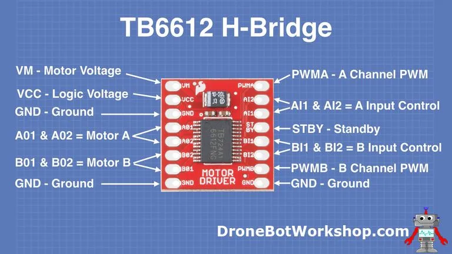

# Seguidor de Linha com controle PID mais Rápido da história do IFPR Foz do Iguaçu 

Feito Por Guilherme C. Wernke
Agradecimentos:
-------------------------------------
Este Robô que vou os apresentar é uma caminhada ao longo dos anos de competição da RoboFalls,
contendo aprendizados de alunos que nem cheguei a conhecer, e desejo passar o conhecimento deles somado ao meu para você que  está lendo, desejo que faça proveito.
E que vocês caros girinos da programação, consigam melhorar este meu robô além do que fui capaz pelas limitações de tecnologias e materias, e que tragam ao legado de Samuel foi pro Céu e Comeu Pastel a glória do pódio!!

Samuel foi pro Céu Comeu Pastel
-----------------------------------------------

O "corpo" de meu robô foi implementado seguindo o modelo desenhado por Marcelo A. de Freitas, veterano meu, cortado em acrilico  na cortadora a laser com auxilio do professor Alcione e Daniel.
Existem alguns Chassis  disponibilizados por este Veterano.
* [1.1 - 9cm](https://www.tinkercad.com/things/3KVw3moEzRr-copy-of-chassi-pid-11-9cm): Versão modelada levemente por mim
* [10 - 9cm](https://www.tinkercad.com/things/674M23AQ8IG-chassi-pid-30-9cm?sharecode=VuWsXbfntqKQkLqW8n-Iqu1Yin6xo8c76XTaxZBWmFQ): Versão mais perto da origina feita pelo Marcelo.
Nota, **NÃO IMPRIMIR EM 3D** pois tal não gera resistencia necessária para não envergar, o que posteriormente causa envergamento do chassi, perda de tração e instabilidade do robô.

Controle de Velocidade e Código robô Seguidor de Linha
------------------------------------------------

Meu robô Seguidor de Linha é equipado com dois motores de **corrente contínua** da Polulo, de 100rpm. Os quais tem seu **controle de velocidade** e **sentido de rotação** controlado a partir do módulo de ponte H TB6612FNG.

Arduíno
:   O **Arduíno** equipado no robô é um arduino nano, na qual possui o seguinte código:
```
// Inclui a biblioteca para controlar o driver de motores TB6612FNG
#include <SparkFun_TB6612.h>

// Inclui a biblioteca para ler os sensores de linha QTR
#include <QTRSensors.h>

// Cria um objeto chamado "qtr" para usar os métodos da biblioteca QTRSensors
QTRSensors qtr;

// Define quantos sensores QTR você está usando
const uint8_t SensorCount = 8;

// Cria um array para armazenar os valores lidos de cada sensor QTR
uint16_t sensorValues[SensorCount];

// Define os pinos conectados ao driver de motores TB6612FNG
#define STBY 2    // Pino para ativar/desativar o driver (Standby)
#define PWMA 5    // Pino PWM para motor A (Esquerdo)
#define PWMB 6    // Pino PWM para motor B (Direito)
#define AIN1 8    // Pinos de controle do motor A
#define AIN2 9
#define BIN1 10   // Pinos de controle do motor B
#define BIN2 11

// Ajusta a direção dos motores se necessário (1 ou -1)
const int offsetA = 1;
const int offsetB = 1;

// Cria objetos para controlar cada motor usando a biblioteca TB6612
// Motor esquerdo (motorEsq) e direito (motorDir)
Motor motorEsq = Motor(AIN1, AIN2, PWMA, offsetA, STBY);
Motor motorDir = Motor(BIN1, BIN2, PWMB, offsetB, STBY);

// Variáveis usadas no controle PID
int PID = 0;                  // Valor final do controle PID
int somatorioErro = 0;        // Soma dos erros (usado para a parte integral do PID)
int deltaErro = 0;            // Diferença entre erro atual e anterior (derivativo)
int erroAnterior = 0;         // Armazena o erro anterior

const int velInercia = 30;    // Velocidade mínima para o motor começar a girar
int velMotor;                 // Velocidade calculada para aplicar no motor

const int velPista = 100;     // "Velocidade base" do robô na pista (pode ajustar entre 0 e 100)

// Constantes para o cálculo do PID

const int Kp = 30;        // Proporcional | Arredondado para inteiro (você pode usar float se quiser)
const int Kd = 10;         // Derivativo | Arredondado para inteiro
const float Ki = 0.1;   // Integral | Use float para KI!

// Variáveis para controlar a parada do robô
int contFim = 5;              // Quantas vezes o sensor de parada deve ser ativado para parar de vez, adicionar o número de interceções +1 
bool flagFim = false;         // Auxiliar para detectar transição do sensor
const int sensorFim = A7;     // Pino do sensor de parada (analógico)
const int LIMIAR_SENSOR = 800;

void setup() 
{

  // Inicializa a comunicação serial para enviar informações para o computador
  Serial.begin(9600);

  // Configura os sensores QTR como tipo RC (recomenda usar RC para a maioria dos QTR)
  qtr.setTypeRC();

  // Define os pinos onde os sensores QTR estão conectados (ajuste para seus pinos)
  qtr.setSensorPins((const uint8_t[]){A0, A1, A2, A3, A4, A5, 4, 3}, SensorCount);

  // Configura o pino do LED embutido e do sensor de parada
  pinMode(LED_BUILTIN, OUTPUT); // LED do Arduino para indicar calibração
  pinMode(sensorFim, INPUT);    // Pino do sensor de parada como entrada

  // Liga o LED do Arduino para avisar que vai calibrar os sensores
  digitalWrite(LED_BUILTIN, HIGH);

  // Calibra os sensores QTR (move o robô sobre a linha durante esse tempo)
  // Faz 400 leituras para calibrar o mínimo/máximo de cada sensor
  for (uint16_t i = 0; i < 400; i++) qtr.calibrate();

  // Desliga o LED do Arduino, indicando que a calibração terminou
  digitalWrite(LED_BUILTIN, LOW);

  // Mostra na tela os valores mínimos capturados na calibração para cada sensor
  for (uint8_t i = 0; i < SensorCount; i++) 
  {
    Serial.print(qtr.calibrationOn.minimum[i]);
    Serial.print(' ');
  }
  Serial.println();

  // Mostra na tela os valores máximos capturados na calibração para cada sensor
  for (uint8_t i = 0; i < SensorCount; i++) 
  {
    Serial.print(qtr.calibrationOn.maximum[i]);
    Serial.print(' ');
  }
  Serial.println("\n");

  // Espera 2 segundos antes de começar o loop principal
  delay(2000);

}

// Função para calcular o PID, que ajusta a velocidade dos motores para seguir a linha
void calculaPID () 
{

  // Lê a posição da linha usando todos os sensores QTR
  // O valor vai de 0 (linha totalmente na esquerda) até 7000 (linha totalmente na direita)
  uint16_t position = qtr.readLineWhite(sensorValues);

  // Calcula o erro: diferença entre o centro ideal (3500) e a posição atual
  float erro = ((float)position - 3500) / 1000.0; // Normaliza para ficar entre -3.5 e +3.5

  // Soma dos erros para o termo integral do PID
  somatorioErro += erro;

  // Diferença entre erro atual e anterior para o termo derivativo
  deltaErro = erro - erroAnterior;

  // Atualiza o erro anterior para a próxima rodada
  erroAnterior = erro;

  // Calcula o valor do PID (Proporcional + Integral + Derivativo)
  PID = Kp * erro + Ki * somatorioErro + Kd * deltaErro;

}

// Função para ajustar os motores de acordo com o valor do PID (mantém o robô na linha)
void segueLinha () 
{

  // Calcula a velocidade para cada motor (direito e esquerdo) usando o PID
  int pwmDir = constrain(velPista + PID, -100, 100); // Motor direito
  int pwmEsq = constrain(velPista - PID, -100, 100); // Motor esquerdo

  // Calcula PWM para faixa completa do drive (positivo = frente, negativo = trás)
  if (pwmDir > 0) 
  {
    pwmDir = map(pwmDir, 0, 100, velInercia, 255);
  } 
  else if (pwmDir < 0) 
  {
    pwmDir = -map(-pwmDir, 0, 100, velInercia, 255); // negativo para trás
  }
  motorDir.drive(pwmDir); // motorDir usa drive()

  if (pwmEsq > 0) 
  {
    pwmEsq = map(pwmEsq, 0, 100, velInercia, 255);
  } 
  else if (pwmEsq < 0) 
  {
    pwmEsq = -map(-pwmEsq, 0, 100, velInercia, 255); // negativo para trás
  }
  motorEsq.drive(pwmEsq); // motorEsq usa drive()
}

// Função para parar ambos os motores
void paraMotores() 
{
  motorDir.brake(); // Para o motor direito
  motorEsq.brake(); // Para o motor esquerdo
}

// Função principal que fica repetindo enquanto o Arduino está ligado
void loop() 
{
  
  // Se o contador de final de pista for zero ou menor, para os motores
  if (contFim <= 0) 
  {
    paraMotores();
    Serial.println("Parou");
  } 
  else 
  {
    // Calcula o PID usando os sensores
    calculaPID();

    // Ajusta os motores de acordo com o valor do PID
    segueLinha();
    
    // Lê o sensor de parada (detecta interseção)
    int leituraSensorFim = analogRead(sensorFim);
    Serial.print("Sensor parada: ");
    Serial.println(leituraSensorFim);

    // Libera flag quando volta para pista (valor < 800)
    if (leituraSensorFim < LIMIAR_SENSOR && flagFim) 
    {
      flagFim = false;
    }

    // Detecta cruzamento de pista para linha: transição para valor >= 800
    if (leituraSensorFim >= LIMIAR_SENSOR && !flagFim) 
    {
      contFim--;
      flagFim = true;
      Serial.print("Interseção detectada. Restam: ");
      Serial.println(contFim);
      if (contFim == 0) 
      {
        delay(0150);
      }
    }

  }
}
```
Caso decida usar este código como modelo saiba das seguintes coisas:
- Somente funciona com os sensroes QTR-8 e com a Ponte H TB6612FNG.

Calibração do PID
----------------------------------

 **KP**
 Os valores das constantes devem ser calibradas iniciando pelo KP em um valor aleatório e tendo KD e KI zerados, calibre até chegar em um desempenho que não de para aumentar ou diminuir o KP sem piorar o tempo de volta do robo, (use uma margem de erro). 
 Nesse passo, se o robo começar a girar frenéticamente, diminua o KP, está ficando muito alto o valor de "Girar para o lado" do robô.
 Caso ocorra do robô sair da pista **em curvas**, aumente o kp, o valor está baico enão está virando o suficient.

 **KI**
 Nessa etapa depois de calibrar o KP é importante notar uma coisa, se o robô tende a sair para um lado **nas retas**, de modo que ele sempre deve corrigir voltando para a pista, nesse caso começe com KI  muito baixo, (0.01) e aumente até isso parar de ocorrer, de preferencia para não usar, pois pode causar erros de sobrealimentação do valor do controle de velocidades dos motores / o valor de "Girar para o lado"!

 **KD**
 Começe assim como o KI (caso tenha o feito) por valores baixos (mas não tanto), em torno de 1 ou 5, o intuito do KD é deixar as curvas mais lisas e  rápidas, então **use o KD**.
 Caso o robô ainda não esteja fazendo as curvas perfeittas como deseja, aumente o KD até o desejado, caso o robô pareça estar tendo vida própria e indo pro céu, diminua o KD até um valor aceitável de funcionamento.

 Dicas:
 - Caso esteja tendo dificuldades com a calibração das constantes, diminua a velocidade e tente denovo.
 - Sempre confira a voltagem da bateria, antes de qualquer coisa!

Para mais informações confira o repositório desta mesma conta denominado "roboPID"!

Hardware do Robô
----------------------------------

O **hardware** do Samuel possui como módulos principais um **Arduíno Nano**, um **vetor de sensores de reflectância QTR-8 tipo RC**, um **Ponte H TB6612FNG**, um **regulador de tensão** e uma **bateria  11v**.


### Arduíno Nano


### Vetor de sensores QTR-8

O **vetor de sensores de reflectância QTR-8** possui **8 leds IR/fototransistores** (emissores infravermelho/receptores) montados em uma única placa, projetado para ser utilizado em **seguidores de linha**.

Há dois tipos de sensores **QTR-8**:

* [QTR-8A](https://www.pololu.com/product/960): Utiliza leitura analógica dos sensores
* [QTR-8RC](https://www.pololu.com/product/961): Utiliza portas digitais para fazer leitura dos sensores

Biblioteca para Arduíno
:   [Arduino Library for the Pololu QTR Reflectance Sensors](https://www.pololu.com/docs/0J19)

Leitura dos sensores
:   O programa utiliza uma função disponível na **biblioteca QTR-8** que fornece a **posição** do vetor em relação a linha, variando de 0 a 7000 (sensor 1 até sensor 8). Com o vetor no centro da linha retorna o valor 3500.


### Ponte H TB6612FNG

Note na imagem a baixo que tal Ponte H possui 2 PWM, ambos devem ser colocados **OBRIGATÓRIAMENTE** nos pinos PWM do Arduino, qualquer outro e não irá funcionar!!



Referências
-----------

1. <http://labdegaragem.com/profiles/blogs/tutorial-rob-seguidor-de-linha-com-controle-pid-e-ajustes-por>
