# Sistemas de Controle

Sistemas de Controle
====================

Referência principal
:   OGATA, Katsuhiko. Engenharia de Controle Moderno, 5a Ed, Pearson, 2011. [[1]](#cite_note-OGATA-1).

Um **sistema de controle em malha fechada** procura manter a saída do sistema alinhada com uma **referência**. Para tal, monitora uma variável do sistema com um **sensor** e compara com a referência. O **erro** resultante é utilizado para ajustar a **ação de controle** ([[1]](#cite_note-OGATA-1), p. 7).

[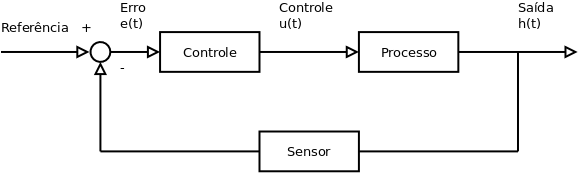](/wiki/index.php/Arquivo:SistemasControle.png)

Controle On / Off
-----------------

O **controle on/off** procura ajustar a saída do sistema com a referência ligando e desligando a ação de controle. Por exemplo, para manter uma dada temperatura em um forno, liga ou desliga a resistência de aquecimento, caso a temperatura fique abaixo ou acima do ponto de referência, respectivamente ([[1]](#cite_note-OGATA-1), p. 19-20).

[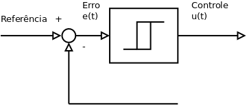](/wiki/index.php/Arquivo:ControleOnOff.png)

É interessante a ação de **controle on/off** ter um **intervalo diferencial** na referência para evitar comutações excessivas.

Gráfico da saída com controle On/Off
:   A saída de um sistema com controle On/Off oscila entre dois pontos, ligeiramente acima e abaixo da referência.

[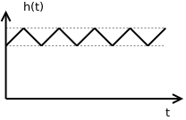](/wiki/index.php/Arquivo:GradicoOnOff.png)

Controle Proporcional
---------------------

O **controle proporcional** ajusta a ação de controle de forma **proporcional ao erro** gerado ([[1]](#cite_note-OGATA-1), p. 21).

[](/wiki/index.php/Arquivo:ControleProporcional.png)

```
        u
        (
        t
        )
        =
        
          K
          
            p
          
        
        e
        (
        t
        )
      
    
    {\displaystyle u(t)=K_{p}e(t)}
  

```

**Função de Transferência** (Transformada de Laplace):

```
              U
              
                s
              
            
            
              E
              
                s
              
            
          
        
        =
        
          K
          
            p
          
        
      
    
    {\displaystyle {U_{s} \over E_{s}}=K_{p}}
  

```

A ação de **controle proporcional** funciona como um **amplificador com ganho variável**, proporcional ao erro.

Controle Integral
-----------------

O **controle integral** ajusta a ação de controle em função ao **somatório do erro** em um dado intervalo de tempo ([[1]](#cite_note-OGATA-1), p. 21).

[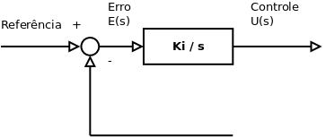](/wiki/index.php/Arquivo:ControleIntegral.png)

```
        u
        (
        t
        )
        =
        
          K
          
            i
          
        
        
          ∫
          
            0
          
          
            t
          
        
        e
        (
        t
        )
        d
        t
      
    
    {\displaystyle u(t)=K_{i}\int _{0}^{t}e(t)dt}
  

```

**Função de Transferência** (Transformada de Laplace):

```
              U
              
                s
              
            
            
              E
              
                s
              
            
          
        
        =
        
          
            
              K
              
                i
              
            
            s
          
        
      
    
    {\displaystyle {U_{s} \over E_{s}}={K_{i} \over s}}
  

```

### Ação de controle integral

Na ação de **controle integral** a saída do controlador é igual a **área sobre a curva do erro** (**integral do erro**) atuante até aquele instante de tempo ([[1]](#cite_note-OGATA-1), p. 197).

Quando o erro fica nulo a ação de controle permanece num estado estacionário, função do somatório dos erros anteriores.

**Gráfico do Controle Integral**:

[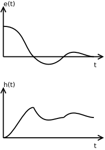](/wiki/index.php/Arquivo:GraficoControleIntegral.png)

Controle Proporcional Integral
------------------------------

O controle proporcional integral combina a ação de controle proporcional e integral ([[1]](#cite_note-OGATA-1), p. 21).

[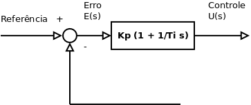](/wiki/index.php/Arquivo:ControlePI.png)

```
        u
        (
        t
        )
        =
        
          K
          
            p
          
        
        e
        (
        t
        )
        +
        
          
            
              K
              
                p
              
            
            
              T
              
                i
              
            
          
        
        
          ∫
          
            0
          
          
            t
          
        
        e
        (
        t
        )
        d
        t
      
    
    {\displaystyle u(t)=K_{p}e(t)+{K_{p} \over T_{i}}\int _{0}^{t}e(t)dt}
  

```

onde, Ti é o tempo integral.

**Função de Transferência** (Transformada de Laplace):

```
              U
              
                s
              
            
            
              E
              
                s
              
            
          
        
        =
        
          K
          
            p
          
        
        (
        1
        +
        
          
            1
            
              
                T
                
                  i
                
              
              s
            
          
        
        )
      
    
    {\displaystyle {U_{s} \over E_{s}}=K_{p}(1+{1 \over T_{i}s})}
  

```

### Erro estacionário do controle proporcional

Sem o **controle integral** há um **erro estacionário** (também chamado **erro residual**) inerente ao **controle proporcional** ([[1]](#cite_note-OGATA-1), p. 197).

**Gráfico do Controle PI**:

[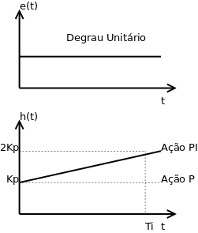](/wiki/index.php/Arquivo:GraficoPI.png)

Controle Proporcional Derivativo
--------------------------------

O **controle proporcional derivativo** combina o controle proporcional com o controle derivativo. O **controle derivativo** procura ajustar a ação de controle em função da taxa de variação do erro ([[1]](#cite_note-OGATA-1), p. 21).

[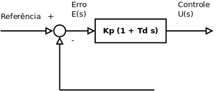](/wiki/index.php/Arquivo:ControlePD.png)

```
        u
        (
        t
        )
        =
        
          K
          
            p
          
        
        e
        (
        t
        )
        +
        
          K
          
            p
          
        
        
          T
          
            d
          
        
        
          
            
              d
              e
              (
              t
              )
            
            
              d
              t
            
          
        
      
    
    {\displaystyle u(t)=K_{p}e(t)+K_{p}T_{d}{de(t) \over dt}}
  

```

onde, Td é o tempo derivativo.

**Função de Transferência** (Transformada de Laplace):

```
              U
              
                s
              
            
            
              E
              
                s
              
            
          
        
        =
        
          K
          
            p
          
        
        (
        1
        +
        
          T
          
            d
          
        
        s
        )
      
    
    {\displaystyle {U_{s} \over E_{s}}=K_{p}(1+T_{d}s)}
  

```

### Ação do controle derivativo

A ação do **controle derivativo** é proporcional a **taxa de variação do erro** atuante. Deve ser usada em períodos transitórios ([[1]](#cite_note-OGATA-1), p. 201).

**Gráfico do Controle PD**:

[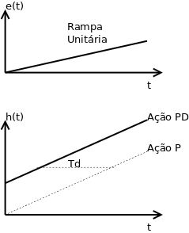](/wiki/index.php/Arquivo:GraficoPD2.png)

Controle Proporcional Integral Derivativo
-----------------------------------------

O **controle proporcional integral derivativo** combina as três ações de controle, visando atingir rapidamente a referência, minimizando os transitórios e eliminando o possível erro residual ([[1]](#cite_note-OGATA-1), p. 21).

[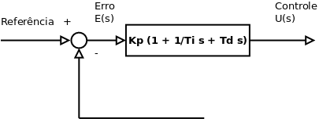](/wiki/index.php/Arquivo:ControlePID.png)

```
        u
        (
        t
        )
        =
        
          K
          
            p
          
        
        e
        (
        t
        )
        +
        
          
            
              K
              
                p
              
            
            
              T
              
                i
              
            
          
        
        
          ∫
          
            0
          
          
            t
          
        
        e
        (
        t
        )
        d
        t
        +
        
          K
          
            p
          
        
        
          T
          
            d
          
        
        
          
            
              d
              e
              (
              t
              )
            
            
              d
              t
            
          
        
      
    
    {\displaystyle u(t)=K_{p}e(t)+{K_{p} \over T_{i}}\int _{0}^{t}e(t)dt+K_{p}T_{d}{de(t) \over dt}}
  

```

onde, Ti é o tempo integral e Td é o tempo derivativo.

**Função de Transferência** (Transformada de Laplace):

```
              U
              
                s
              
            
            
              E
              
                s
              
            
          
        
        =
        
          K
          
            p
          
        
        (
        1
        +
        
          
            1
            
              
                T
                
                  i
                
              
              s
            
          
        
        +
        
          T
          
            d
          
        
        s
        )
      
    
    {\displaystyle {U_{s} \over E_{s}}=K_{p}(1+{1 \over T_{i}s}+T_{d}s)}
  

```

**Gráfico do Controle PID**:

[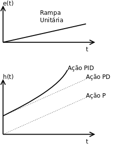](/wiki/index.php/Arquivo:GraficoPID2.png)

Referências
-----------

1. ↑ [1,00](#cite_ref-OGATA_1-0) [1,01](#cite_ref-OGATA_1-1) [1,02](#cite_ref-OGATA_1-2) [1,03](#cite_ref-OGATA_1-3) [1,04](#cite_ref-OGATA_1-4) [1,05](#cite_ref-OGATA_1-5) [1,06](#cite_ref-OGATA_1-6) [1,07](#cite_ref-OGATA_1-7) [1,08](#cite_ref-OGATA_1-8) [1,09](#cite_ref-OGATA_1-9) [1,10](#cite_ref-OGATA_1-10) OGATA, Katsuhiko. Engenharia de Controle Moderno,5a Ed, Pearson, 2011.

---

--[Evandro.cantu](/wiki/index.php/Usu%C3%A1rio:Evandro.cantu "Usuário:Evandro.cantu") ([discussão](/wiki/index.php?title=Usu%C3%A1rio_Discuss%C3%A3o:Evandro.cantu&action=edit&redlink=1 "Usuário Discussão:Evandro.cantu (página inexistente)")) 19h03min de 4 de maio de 2018 (BRT)

---

Disponível em “<http://wiki.foz.ifpr.edu.br/wiki/index.php?title=Sistemas_de_Controle&oldid=29640>”
