# Arduino: Entradas e Saidas

Índice
------

* [1 Arduíno: Entradas e Saídas](#Arduíno:_Entradas_e_Saídas)
  + [1.1 Características do microcontrolador Arduíno](#Características_do_microcontrolador_Arduíno)
  + [1.2 Saídas digitais](#Saídas_digitais)
    - [1.2.1 Laboratório 1: Saída digital](#Laboratório_1:_Saída_digital)
  + [1.3 Leds](#Leds)
    - [1.3.1 Projeto 1: Semáforo automatizado com leds](#Projeto_1:_Semáforo_automatizado_com_leds)
  + [1.4 Entradas digitais](#Entradas_digitais)
  + [1.5 Chave digital](#Chave_digital)
    - [1.5.1 Laboratório 2: Chave digital](#Laboratório_2:_Chave_digital)
    - [1.5.2 Projeto 2: Coreografia com leds](#Projeto_2:_Coreografia_com_leds)
  + [1.6 Entradas Analógicas](#Entradas_Analógicas)
  + [1.7 Potenciômetros](#Potenciômetros)
    - [1.7.1 Laboratório 3: Leitura de entrada analógica](#Laboratório_3:_Leitura_de_entrada_analógica)
    - [1.7.2 Projeto 3: Coluna de leds e potenciômetro](#Projeto_3:_Coluna_de_leds_e_potenciômetro)
  + [1.8 Saídas Analógicas](#Saídas_Analógicas)
    - [1.8.1 Laboratório 4: Saída analógica](#Laboratório_4:_Saída_analógica)
  + [1.9 Monitor Serial](#Monitor_Serial)
    - [1.9.1 Laboratório 5: Monitor serial](#Laboratório_5:_Monitor_serial)
  + [1.10 Led RGB](#Led_RGB)
    - [1.10.1 Leds RGB](#Leds_RGB)
    - [1.10.2 Laboratório 6: Led RGB](#Laboratório_6:_Led_RGB)
    - [1.10.3 Projeto 4: Misturando as cores primárias com leds RGB](#Projeto_4:_Misturando_as_cores_primárias_com_leds_RGB)
  + [1.11 Referências](#Referências)

Arduíno: Entradas e Saídas
==========================

O Arduíno pode ler **sensores** através de pinos de **entrada digitais e analógicas**, assim como controlar **atuadores** através de **saídas digitais** e **saídas PWM**.

Características do microcontrolador Arduíno
-------------------------------------------

[Arduino](/wiki/index.php/Arduino "Arduino")

[Site oficial do Arduíno](https://www.arduino.cc/)

Arduino UNO

[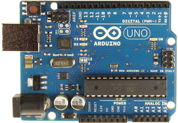](/wiki/index.php/Arquivo:PinosArduinoUno.png)

Saídas digitais
---------------

O Arduíno UNO possui 14 Entradas/Saídas Digitais

* As entradas/saídas digitais estão localizadas nos **pinos** **0** a **13**.
* Estas entradas/saídas operam com valores **digitais** **LOW** e **HIGH**, os quais correspondem aos valores de **tensão** **0 V** e **5 V**, respectivamente..
* Cada pino fornece **corrente** de até **20 mA**, sendo que qualquer corrente solicitada acima de **40mA** pode danificar o Arduíno.

pinMode
:   Comando da linguagem de programação do Arduíno que configura o **pino digital** como **entrada** (**INPUT**) ou **saída** (**OUTPUT**).
:   Exemplo:

```
pinMode(13, OUTPUT);
```

digitalWrite
:   Comando para **escrever** na saída digital.

```
digitalWrite(13, HIGH/LOW);
```

### Laboratório 1: Saída digital

digitalWrite

* Carregar no Arduíno o programa exemplo **[Arquivo/Exemplos/Basic/Blink](https://www.arduino.cc/en/Tutorial/Blink)** para **piscar** o **led do pino 13**, mantendo acesso por 1 seg e em seguida apagada por 1 seg. O **led do pino 13** é um led instalado na própria placa do Arduíno.
* Modificar o **tempo** (***delay***) e verificar a mudança na **frequência** do piscar do led.

:   A função **delay(1000);** estabelece um atraso em **ms** (mili segundos), logo **1000 ms = 1 s**.

Leds
----

[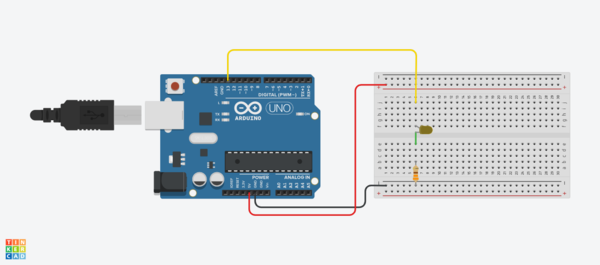](/wiki/index.php/Arquivo:Arduino_Blink.png)

Um **led** é um **diodo emissor de luz** (*light emitting diode*). Ele se comporta como um [**Diodo**](/wiki/index.php/Diodos "Diodos"), conduzindo apenas quanto polarizado diretamente.

[](/wiki/index.php/Arquivo:Led.jpeg)

Um **led** não pode receber tensão diretamente em seus terminais sob risco de colocar o componente em **curto-circuito**. A **corrente elétrica** no led deve ser limitada, tipicamente entre **10 mA** a **30 mA** por um **resistor** externo.

A **queda de tensão direta** nos leds depende da **cor do led**. De modo simplificado, tipicamente se usa-se queda de tensão de **2 V**.

Exemplo cálculo do resistor de proteção de um circuito com led
:   Supondo:

```
Iled = 10 mA
```

[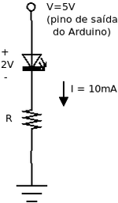](/wiki/index.php/Arquivo:CircuitoLed.png)

Soma das tensões ao longo da malha (2a Lei de Kirchhoff):

```
V = Vled + R.I
```

:   Isolando R:

```
R = (V - Vled) / I
```

:   Atribuindo valores:

```
V = 5V, Vled = 2V, I = 10mA
```

:   Calculando:

```
R = (5 - 2)/(10/1000) = 3/(1/100) = 3 . 100 = 300Ω
```

:   Valores comerciais:

```
270Ω ou 330Ω
```

[Código de cores de resistores](/wiki/index.php/Resistores "Resistores")

### Projeto 1: Semáforo automatizado com leds

Semáforo

* Montar hardware para acionamento de **3 leds** (vermelho, verde e amarelo), comandados por 3 saídas digitais independentes do Arduíno, utilizando **resistores** de proteção adequados.
* Modificar programa **[Arquivo/Exemplos/Basic/Blink](https://www.arduino.cc/en/Tutorial/Blink)** para acionar os leds como um **semáforo**, com **temporização** adequada para cada cor.

[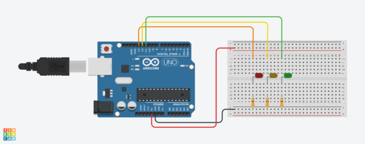](/wiki/index.php/Arquivo:Arduino_Semaforo.png)

Entradas digitais
-----------------

Um **pino digital** do Arduíno pose ser definido como **entrada** (INPUT).

```
pinMode(2, INPUT);
```

digitalRead
:   Comando para **ler** o estado de uma entrada digital.

```
int estadoPino; 
estadoPino = digitalRead(2);
```

Neste caso o Arduíno vai **ler** se o **estado** do pino é **LOW** (0 V) ou **HIGH** (5 V).

Chave digital
-------------

Uma **chave digital** fornecerá **0 V** (**LOW**) ou **5 V** (**HIGH**) caso estiver aberta ou fechada.

[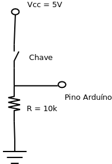](/wiki/index.php/Arquivo:ChaveDigital.png)

Funcionamento:

* Caso a chave estiver **aberta**, não haverá corrente no o resistor e a tensão entregue ao pino do Arduíno será **0 V**.
* Caso a chave estiver **fechada**, haverá corrente no resistor e a tensão entregue ao pino do Arduíno será **5 V**.

Corrente no resistor:

```
V = R I (Lei de Ohm)
```

:   Isolando I:

```
I = V / R
```

:   Atribuindo valores:

```
V=5V, R=10k(Ω)  (Prefixos SI)
```

:   Calculando:

```
I = 5/10 . (1/103) = 0,5 . 10-3 = 0,5 mA
```

:   Corrente desprezível para o Arduíno.

### Laboratório 2: Chave digital

[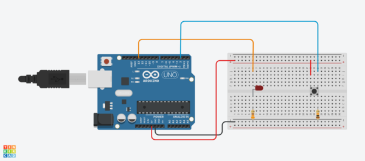](/wiki/index.php/Arquivo:Arduino_Botao.png)

digitalRead

* Montar hardware com **chave** (***push botton***), utilizando **resistores** de proteção de 10 KΩ.
* Carregar programa exemplo **[Arquivo/Exemplos/Digital/Button](http://www.arduino.cc/en/Tutorial/Button)** para ligar ou desligar led em função de pressão em chave digital.
* Carregar programa exemplo **[Arquivo/Exemplos/Basic/DigitalReadSerial](https://www.arduino.cc/en/Tutorial/DigitalReadSerial)** para verificar no terminal serial o valor da chave digital.

### Projeto 2: Coreografia com leds

Implementar uma **coreografia de luzes** com 6 **leds** e 2 **chaves digitais**, de forma que, a cada combinação de chaves acionadas uma coreografia de luzes seja executada.

Entradas Analógicas
-------------------

O Arduíno UNO possui 6 entradas analógicas
:   As **entradas analógicas** utilizam um processo de **[Conversão Analógico Digital](/wiki/index.php/Conversao_Analogico_Digital "Conversao Analogico Digital") (ADC)** para obter valores digitais correspondentes a cada entrada.

* As **entradas analógicas** são nomeadas de **A0** até **A5**.
* Cada entrada analógica recebe **valores analógicos** entre **0 V** e **5 V**.
* Os valores analógicos são convertidos para **valores digitais** com **10 bits de resolução** (valores entre **0** (0000000000) a **1023** (1111111111).

analogRead
:   Comando para **ler** entrada analógica.

```
int valorPino;
valorPino = analogRead(A0);
```

Potenciômetros
--------------

São **resistências variáveis** através de um cursor.

:   Na figura, através de um **potenciômetro** é possível implementar um **divisor de tensão** com uma tensão variável Vx obtida a partir do terminal central do potenciômetro.

[](/wiki/index.php/Arquivo:Potenciometro.png) [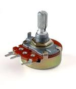](/wiki/index.php/Arquivo:Potenciometro.jpg)

### Laboratório 3: Leitura de entrada analógica

[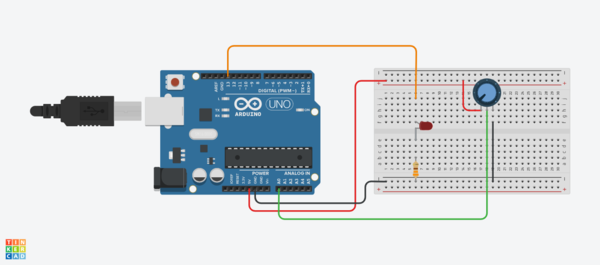](/wiki/index.php/Arquivo:Arduino_Potenciometro.png)

analogRead

* Montar hardware com utilizando o ponto central de um **potenciômetro** conectado a **entrada analógica A0** (com os demais terminais conectados ao GND e 5V, respectivamente).
* Carregar programa exemplo **[Arquivo/Exemplos/Basic/AnalogReadSerial](https://www.arduino.cc/en/Tutorial/AnalogReadSerial)** e verificar o valor da entrada analógica no **monitor serial**.
* Carregar programa exemplo **[Arquivo/Exemplos/Basic/ReadAnalogVoltage](https://www.arduino.cc/en/Tutorial/ReadAnalogVoltage)** e verificar o valor da entrada analógica em **Volts** no **monitor serial**.
* Carregar programa exemplo **[Arquivo/Exemplos/Analog/AnalogInput](http://www.arduino.cc/en/Tutorial/AnalogInput)** e verificar o valor da **frequência** do pulsar do **led** em função do valor do **potenciômetro**.

### Projeto 3: Coluna de leds e potenciômetro

* Montar hardware com uma **coluna de 5 leds** utilizando um resistor de proteção para cada led e um **potenciômetro**.
* Acender a **coluna de leds** em função da tensão lida no ponto central do **potenciômetro**.

Saídas Analógicas
-----------------

O Arduíno emula **saídas analógicas** através de **modulação PWM** (*Pulse Width Modulation*).

O **sinal PWM** é uma **onda quadrada**, com frequência constante, mas a fração de tempo em que o sinal é HIGH (5V) (*duty cycle*) pode variar entre 0 e 100%, fornecendo uma média de tensão variável na saída [[1]](#cite_note-1).
[](/wiki/index.php/Arquivo:PWM.gif)

As **6 Saídas PWM** são identificadas pelo sinal **~** e fornecem **saídas analógicas** através de **pulsos PWM** de **8 bits**, possibilitando, portanto, **256 valores** diferentes de **tensão analógica** entre **0V e 5V**, com passos de **0 a 255**.

### Laboratório 4: Saída analógica

analogWrite

analogRead

map;

* Montar hardware para acionamento de **led** conectado ao **pino 9**, escolhendo resistor de proteção adequado;
* Carregar programa exemplo **[Arquivo/Exemplos/Basic/Fade](https://www.arduino.cc/en/Tutorial/Fade)** e verificar a variação da luminosidade do **led** da porta 9.
* Montar hardware com utilizando o ponto central de um **potenciômetro** conectado a **entrada analógica A0** (com os demais terminais conectados ao GND e 5V, respectivamente).
* Carregar programa exemplo **[Arquivo/Exemplos/Analog/AnalogInOutSerial](https://www.arduino.cc/en/Tutorial/AnalogInOutSerial)** e verificar a variação da luminosidade do **led** da **pino 9** em função do **potenciômetro**.

Monitor Serial
--------------

O **monitor serial** permite enviar dados do **computador** ao **Arduíno** pela **interface serial USB**.

### Laboratório 5: Monitor serial

* Carregar programa exemplo **[Arquivo/Exemplos/Communication/PhysicalPixel](http://www.arduino.cc/en/Tutorial/PhysicalPixel)** e **acionar** o **led** do **pino 13** a partir de comandos **H** e **L** enviados pelo terminal serial.
* Montar hardware para acionamento de **led** conectado ao **pino 9**, escolhendo resistor de proteção adequado;
* Carregar programa exemplo **[Arquivo/Exemplos/Communication/Dimmer](http://www.arduino.cc/en/Tutorial/Dimmer)** e **controlar a intensidade** do **led** do **pino 9** a partir do envio de valores entre **0 e 255** pelo terminal serial.

  :   No programa exemplo acima, trocar a linha:

```
brightness = Serial.read();
```

:   :   por

```
brightness = Serial.parseInt();
```

:   :   para converter os caracteres ASCII lidos para inteiros.

Led RGB
-------

Um **led RGB** apresenta em um único led a possibilidade de fornecer todas as cores, obtidas a partir da mistura das **cores primárias luz**, ou **cores primárias aditivas**, que são **vermelho** (***R**ed*), **verde** (***G**reen*) e **azul** (***B**lue*).

* As **cores primárias** não resultam da mistura de nenhuma cor.
* A **cor branca** é a soma das três cores primárias.
* As **cores secundárias** são misturas de duas cores, como o **amarelo**, **ciano** e **magenta**.
* A **cor preta** é a ausência de cores.
* As **demais cores** requerem **mistura** das três cores primárias em quantidades específicas.

[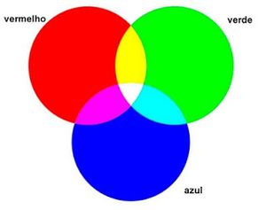](/wiki/index.php/Arquivo:CoresPrimarias.jpg)

COLOR PICKER
:   A ferramenta **[color picker](http://htmlcolorcodes.com/color-picker/)** é utilizada para obter as **misturas das cores primárias** utilizada na **Linguagem HTML** com uma paleta de **256 cores RBG**.
:   A quantidade de cada cor **RGB** está expressa em **hexadecimal** de **8 bits**, por exemplo, o **amarelo** é **#FFFF00**, ou seja, é o resultado da mistura do **vermelho** (FF ou 255) e do **verde** (FF ou 255), sem nada de **azul** (00 ou 0) .
:   A quantidade de cada cor **RGB** também é mostrada em valores de 0 a 255.

### Leds RGB

Os **leds RGB** são encontrados em duas estruturas:

* Anodo comum;
* Catodo comum.

[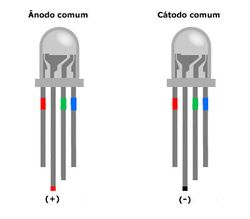](/wiki/index.php/Arquivo:LedRGB.jpeg)
[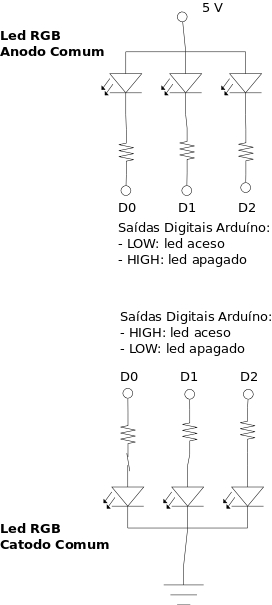](/wiki/index.php/Arquivo:LedRGB.png)

### Laboratório 6: Led RGB

Cores primárias
:   digitalWrite.

* Montar hardware para **led RGB anodo comum** utilizando **resistores** de proteção adequados.
* Modificar programa ***blink*** para piscar cores **vermelho** (R), **verde** (G) e **azul** (B) alternadamente;
* Variar a  **[frequência](/wiki/index.php/Frequ%C3%AAncia_e_per%C3%ADodo_de_um_sinal_peri%C3%B3dico "Frequência e período de um sinal periódico")** do piscar de leds RGB nos seguintes valores:
  + 1 Hz
  + 10 Hz
  + 100 Hz
  + 1000Hz

:   Verificar o resultado nas cores observadas.

### Projeto 4: Misturando as cores primárias com leds RGB

Misturando as cores primárias
:   analogWrite

* Montar hardware para **led RGB anodo comum** utilizando os pinos 3, 5 e 6 respectivamente.
* Carregar programa exemplo **[Arquivo/Exemplos/Communication/ReadASCIIString](https://www.arduino.cc/en/Tutorial/ReadASCIIString)** e **misturar as cores** do **led RGB** utilizando quantidades de RGB de 0 a 255, de modo a obter as cores mostrada na **tabela de cores** acima.
* Montar hardware com utilizando três **potenciômetros** conectado a três **entradas analógicas**, as quais devem ser combinadas para **misturar as cores** do **led RGB**.

Referências
-----------

1. [↑](#cite_ref-1) <https://www.arduino.cc/en/Tutorial/SecretsOfArduinoPWM>

---

[Evandro.cantu](/wiki/index.php/Usu%C3%A1rio:Evandro.cantu "Usuário:Evandro.cantu") ([discussão](/wiki/index.php?title=Usu%C3%A1rio_Discuss%C3%A3o:Evandro.cantu&action=edit&redlink=1 "Usuário Discussão:Evandro.cantu (página inexistente)")) 09h41min de 17 de setembro de 2021 (-03)

---

Disponível em “<http://wiki.foz.ifpr.edu.br/wiki/index.php?title=Arduino:_Entradas_e_Saidas&oldid=31196>”
