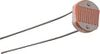
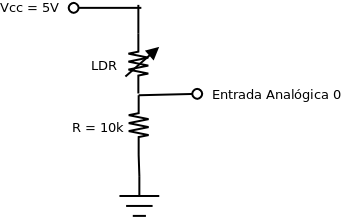
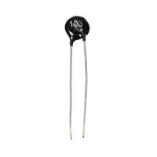
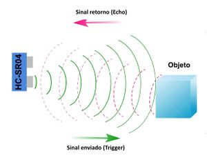
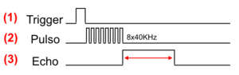

# Arduino: Sensores

Índice
------

* [1 Arduíno: Sensores e Atuadores](#Arduíno:_Sensores_e_Atuadores)
  + [1.1 Informações sobre Arduíno](#Informações_sobre_Arduíno)
  + [1.2 Sensor de Luminosidade LDR](#Sensor_de_Luminosidade_LDR)
    - [1.2.1 Laboratório 1: Sensor de luminosidade LDR](#Laboratório_1:_Sensor_de_luminosidade_LDR)
  + [1.3 Projeto 1: Sistema indicador de luminosidade](#Projeto_1:_Sistema_indicador_de_luminosidade)
  + [1.4 Sensor de Temperatura NTC 10k](#Sensor_de_Temperatura_NTC_10k)
    - [1.4.1 Laboratório 2: Sensor de Temperatura com NTC](#Laboratório_2:_Sensor_de_Temperatura_com_NTC)
      * [1.4.1.1 Exemplo de código 1](#Exemplo_de_código_1)
      * [1.4.1.2 Exemplo de código 2](#Exemplo_de_código_2)
  + [1.5 Sensor de temperatura (LM35)](#Sensor_de_temperatura_(LM35))
    - [1.5.1 Laboratório 3: Sensor de temperatura LM35](#Laboratório_3:_Sensor_de_temperatura_LM35)
  + [1.6 Sensor de Temperatura e Umidade DHT11](#Sensor_de_Temperatura_e_Umidade_DHT11)
    - [1.6.1 Laboratório 4: Sensor de temperatura DHT11](#Laboratório_4:_Sensor_de_temperatura_DHT11)
  + [1.7 Projeto 2: Sistema de acionamento de equipamento de climatização](#Projeto_2:_Sistema_de_acionamento_de_equipamento_de_climatização)
  + [1.8 Sensor Ultrassônico](#Sensor_Ultrassônico)
    - [1.8.1 Sensor Ultrassônico de Distância HC-SR04](#Sensor_Ultrassônico_de_Distância_HC-SR04)
    - [1.8.2 Sensor Ultrassônico de Distância JSN-SR04T](#Sensor_Ultrassônico_de_Distância_JSN-SR04T)
    - [1.8.3 Laboratório 5: Sensor Ultrassônico](#Laboratório_5:_Sensor_Ultrassônico)
  + [1.9 Referências](#Referências)

Arduíno: Sensores e Atuadores
=============================

O Arduíno pode ler **sensores** e acionar **atuadores** através dos pinos de **entrada/saída**, sejam elas **digitais ou analógicas**.

Informações sobre Arduíno
-------------------------

[Arduino](/wiki/index.php/Arduino "Arduino")

[Arduíno: Entradas e Saídas](/wiki/index.php/Arduino:_Entradas_e_Saidas "Arduino: Entradas e Saidas")

[Site oficial do Arduíno](https://www.arduino.cc/)

Sensor de Luminosidade LDR
--------------------------

O **Sensor de luminosidade (LDR)** (*Light Dependent Resistor*) é um **sensor analógico** formado por um **resistor dependente de luz** ou **fotoresistor**, o qual varia sua resistência em função da luminosidade.

[](/wiki/index.php/Arquivo:LDR.jpeg)

Os sensores baseados em **resistência variável** utilizam a estrutura **[divisor de tensão](/wiki/index.php/Divisor_de_Tensao "Divisor de Tensao")** para obter uma tensão variável que pode ser lida por uma entrada analógica do Arduíno.

### Laboratório 1: Sensor de luminosidade LDR

[](/wiki/index.php/Arquivo:DivisorTensao-LDR.png)

* Montar hardware com o **sensor LDR**, conforme mostrado na figura acima.
* Testar o código exemplo **[Arquivo/Exemplos/Analog/AnalogInput](http://www.arduino.cc/en/Tutorial/AnalogInput)**, e verificar o valor da **frequência** do pulsar do **led** em função do valor da **luminosidade**.
* Carregar programa exemplo **[Arquivo/Exemplos/Basic/AnalogReadSerial](https://www.arduino.cc/en/Tutorial/AnalogReadSerial)** e verificar o valor da **entrada analógica** gerada pelo **LDR** no **monitor serial**.

Projeto 1: Sistema indicador de luminosidade
--------------------------------------------

LDR

* Montar hardware com **sensor LDR** utilizando **divisor de tensão** para o sensor e uma **coluna de 5 leds** utilizando um **resistor de proteção** para cada led.
* Construir programa para ir acendendo os **leds** a medida que aumenta a **luminosidade**.

:   Use o programa exemplo **[Arquivo/Exemplos/Basic/AnalogReadSerial](https://www.arduino.cc/en/Tutorial/AnalogReadSerial)** para verificar como a luminosidade do ambiente interfere no LDR.

Sensor de Temperatura NTC 10k
-----------------------------

O **sensor de temperatura NTC 10k** é um **sensor analógico** formado por um **thermistor**, isto é, um resistor cuja resistência varia com a temperatura, podendo medir de −90 °C a 130 °C.

[](/wiki/index.php/Arquivo:NTC_10k.jpg)

Existem dois tipos de thermistores:

* NTC (Negative Temperature Coefficient), no qual a resistência diminui com o aumento da temperatura;
* PTC (Positive Temperature Coefficient), no qual a resistência aumenta com o aumento da temperatura.

Para leitura com o Arduíno, o sensor **NTC 10k** é utilizado numa estrutura com um  **[divisor de tensão](/wiki/index.php/Divisor_de_Tensao "Divisor de Tensao")** com um resistor de 10K Ω.

Esquema de ligação com Arduíno:
[](/wiki/index.php/Arquivo:DivisorTensao-NTC10k.png)

Cálculo da resistência do NTC
:   Na temperatura de 25 °C a resistência do NTC é 10 k Ω, variando linearmente com a temperatura.
:   Portando, quando:

```
RNTC = 10k Ω (25 °C)
```

:   Temos:

```
leitura_analógica = 512 (Vdivisor = 2,5V)
```

:   Logo, para qualquer leitura analógica temos:

```
RNTC = 10k . (1023/leitura_analógica - 1)
```

Equação de Steinhart–Hart
:   A equação de **Steinhart–Hart** (<https://en.wikipedia.org/wiki/Thermistor>), detalha a operação do ***thermistor* NTC** relacionando a variação de **temperatura** (Kelvin) com a **resistência** (Ω).
:   1
    T
    =
    a
    +
    b

    ln
    ⁡
    (
    R
    )
    +
    c

    (
    ln
    ⁡
    (
    R
    )

    )

    3
    {\displaystyle {1 \over T}=a+b\,\ln(R)+c\,(\ln(R))^{3}}
    
:   onde a, b e c são parâmetros de Steinhart–Hart específicos para cada dispositivo.
:   Valores típicos para um thermistor com resistência de 10K Ω na temperatura de (25 °C = 298.15 K) é:

    * a = 0.001129148,
    * b = 0.000234125,
    * c = 0.0000000876741.

### Laboratório 2: Sensor de Temperatura com NTC

Monte o hardware para o **sensor de temperatura** **NTC10k** conectado a entrada analógica A0 do Arduíno.

#### Exemplo de código 1

Uso da biblioteca `math.h` e implementação da equação de Steinhart–Hart.

```
//Sensor de temperatura NTC10k
#include <math.h>
const double a = 0.001129148;     //
const double b = 0.000234125;     //Parâmetros de Steinhart–Hart
const double c = 0.0000000876741; //
void setup() 
{
  Serial.begin(9600);
}
void loop() 
{
  double R;    //Resistência do NTC
  double T;    //Temperatura em Kelvin
  int leitura; //Leitura analógica (0 a 1023)
  leitura = analogRead(A0);
  R = (10000.0 * ((float)1023/leitura - 1));  //Calcula valor de R em função da leitura
  T = 1 / (a + (b * log(R)) + (c * pow(log(R),3))); //Equação de Steinhart–Hart 
  T = T - 273.15; //Converte Kelvin para Celcius
  Serial.print("Temperatura: "); 
  Serial.print(T);
  Serial.println(" oC");  
  delay(1000);
}
```

Observações:

* A função `log()`, utilizado no código exemplo, faz parte da biblioteca `math.h`[[1]](#cite_note-1) e é o logaritmo natural (ln). A função para o logaritmo base 10 seria `log10`.
* Código adaptado de [[2]](#cite_note-2).

#### Exemplo de código 2

Uso da biblioteca `thermistor.h`, a qual implementa a equação de Steinhart–Hart e pode ser baixada de <https://github.com/panStamp/thermistor>.

```
#include "thermistor.h"
THERMISTOR thermistor(A0,     // entrada analógica
                      10000,  // resistência nominal a 25 ºC
                      3950,   // coeficiente beta 
                      10000); // resistor série
float temp;
void setup()
{
  Serial.begin(9600);
}
void loop()
{
  temp = thermistor.read();   // lê temperatura
  Serial.print("Temperatura em 1/10 *C : ");
  Serial.println(temp);
  delay(5000);
}
```

Observações:

* Baseado no exemplo apresentado em[[3]](#cite_note-3).

Sensor de temperatura (LM35)
----------------------------

Funcionamento do sensor LM35
:   O **sensor de temperatura LM35** é um **circuito integrado** exclusivo para medir temperatura com uma tensão de saída analógica variando linearmente com a temperatura em graus Célsius.
:   Na configuração básica este sensor mede temperaturas entre 2oC e 150oC, variando a saída em função da temperatura de 0 mV + 10mV por 1oC.
:   Com a configuração mostrada em [[4]](#cite_note-4) é possível medir temperatura de -55oC e 150oC.

Esquema de ligação com Arduíno

```
            _______
           |       |
           | LM 35 | 
           |_______|
             | | |
   (+5v) ----+ | +---- (Ground)
               |
          Analog Pin 
       0mV + 10mV / oC
```

Leitura pela entrada analógica do Arduíno
:   O valor de tensão (entre **0V e 5V**) lido pelo Arduíno na **entrada analógica** é convertido um número digital com **10 bits de magnitude**, ou seja, 210 (1024) valores (entre 0 e 1023).

:   Para obter o valor de tensão, para uso no cálculo da temperatura, multiplica-se o valor digital obtido na leitura por 5/1023.

:   Como a tensão medida pelo sensor varia de 0 mV + 10mV/1oC, se multiplicarmos por 100, teremos o valor em graus Celsius:

### Laboratório 3: Sensor de temperatura LM35

* Monte o hardware com LM35 conforme a figura, utilizando a entrada analógica A0 para leitura.
* Carregue o código exemplo abaixo e verifique o funcionamento do sensor:

```
 //Sensor de temperatura LM35
 float valorSensor;
 float temperatura;
 void setup() {
   Serial.begin(9600);
 }
 void loop() {
   valorSensor = analogRead(A0) * 5.0 / 1023.0;
   temperatura = valorSensor * 100.0;
   Serial.print("Temperatura: ");
   Serial.println(temperatura);
   delay(2000); //Tempo entre as leituras em ms
 }
```

Sensor de Temperatura e Umidade DHT11
-------------------------------------

O **sensor de temperatura e umidade DHT11** é um **sensor digital** que inclui internamente um medidor de umidade resistivo e um sensor de temperatura tipo NTC conectado a um microcontrolador de 8 bits.

O DHT11 possui uma **biblioteca** com funções prontas para seu funcionamento ([DHT11.zip](/wiki/images/8/8d/DHT11.zip "DHT11.zip")). Há versões atualizadas desta biblioteca disponíveis em [[5]](#cite_note-5).

Esquema de ligação com Arduíno

```
            ________
           |        |
           | DHT11  | 
           |________|
             | | | |
    (5V) ----+ |   +---- (GND)
               |
          Analog Pin 1
```

### Laboratório 4: Sensor de temperatura DHT11

* Monte o hardware com DHT11 conforme a figura, utilizando a entrada analógica A1 para leitura.
* Baixe a biblioteca e salve no computador.

  :   A biblioteca DHT11, contida no arquivo DHT11.zip, é formada por dois arquivos:
      + dht11.h
      + dht11.cpp
* Insira a biblioteca DHT11.zip no ambiente da IDE do Arduíno:

```
Sketch -> Incluir Biblioteca -> Adicionar biblioteca .ZIP
```

* As bibliotecas são instaladas por padrão no diretório:

```
~/Arduino/libraries
```

* Carregue o código exemplo abaixo e verifique o funcionamento do sensor:

```
 //Sensor de temperatura LDHT11
 #include <dht11.h>
 dht11 sensor; //Inicializa sensor
 void setup() {
   Serial.begin(9600);
   delay(1000);
 }
 void loop() {
   sensor.read(A1);
   Serial.print("Temperatura (oC): ");
   Serial.println(sensor.temperature);
   Serial.print("Unidade (%): ");
   Serial.println(sensor.humidity);
   delay(2000); //Tempo entre as leituras em ms
 }
```

Projeto 2: Sistema de acionamento de equipamento de climatização
----------------------------------------------------------------

LDR

* Montar hardware com **sensor de temperatura** (NTC, LM35 ou DHT11) e mais dois **leds** indicadores da temperatura ambiente (verde tempertura menor 25o e vermelho temperatura maior 25o).
* Utilizar uma saída digital para o acionamento de um **led** para simular o ligar/desligar do equipamento de climatização.

Sensor Ultrassônico
-------------------

O **sensor ultrassônico** é um **sensor digital** que se baseia no envio de **sinais ultrassônicos** pelo sensor, que aguarda o retorno do sinal (**echo**), e com base no **tempo entre envio e retorno**, calcula a **distância** entre o sensor e o objeto detectado [[6]](#cite_note-filipeflop-6).

[](/wiki/index.php/Arquivo:SensorUltrasonico_Trigger_Echo.jpg)[[6]](#cite_note-filipeflop-6)

O acionamento do **sensor ultrassônico** é realizado enviando ao pino ***trigger*** um pulso com 10μs (1), o qual faz o sensor disparar um sinal com 8 pulsos de 40 KHz (2) e aguardar o retorno do ***echo*** do sinal em nível alto (3).

[](/wiki/index.php/Arquivo:SensorUltrasonico_Trigger_Echo2.png)[[6]](#cite_note-filipeflop-6)

A **distância** entre o sensor e o objeto pode ser determinada pela equação:

```
distância = tempo do echo em nível alto * velocidade do som / 2
```

### Sensor Ultrassônico de Distância HC-SR04

O sensor ultrasônico HC-SR04[[7]](#cite_note-7) funciona como um detector de objetos e permite medir distâncias mínimas de 2 centímetros podendo chegar a distancias máximas de até 450 centímetros, com uma precisão de 3 milímetros. Funcionamento: Necessita de um gatilho (trigger) de pelo menos 10us de nivel alto. O módulo envia automaticamente 8 pulsos de 40kHz e automaticamente detecta se houve retorno de algum pulso. Se houver um sinal de retorno a partir dos disparos, o nivel de saída é modificado.

### Sensor Ultrassônico de Distância JSN-SR04T

O Sensor Ultrassônico de Distância JSN-SR04T[[8]](#cite_note-8) foi desenvolvido para aperfeiçoar projetos de robótica e microeletrônica, mostrando-se ideal para calcular a distância com precisão de objetos entre ~25cm à ~1,5 metros.

O principal diferencial do Sensor Ultrassônico JSN-SR04T é sua ampla e eficiente resistência à umidade, sendo principalmente utilizado em ambientes úmidos, permitindo manter ampla distância do microcontrolador já que possui fio com 2,5 metros de comprimento, no entanto lembramos que o sensor não pode ser submerso na água.

De forma a facilitar a ligação entre o Sensor Ultrassônico de Distância JSN-SR04T e o Arduino, por exemplo, acompanha um módulo especialmente desenvolvido para atuar em conjunto com microcontroladores, possuindo 4 portas de conexão: 5V (VCC), Trig (RX), Echo (TX) e GND.

O Sensor Ultrassônico de Distância JSN-SR04T possui funcionamento muito semelhante ao Sensor Ultrassônico de Distância HC-SR04, onde permite utilizar o mesmo código de programação.

### Laboratório 5: Sensor Ultrassônico

Testar o exemplo de código para Sensor Ultrassônico:

```
const int trigPin =  4; //Trigger pino 4
const int echoPin =  5; //Echo pino 4
float distancia; 
float duracao;
  
void setup() {
  pinMode(trigPin, OUTPUT); 
  pinMode(echoPin, INPUT); 
  Serial.begin(9600); 
}

void loop() {
  digitalWrite(trigPin, LOW);
  delayMicroseconds(2);
  digitalWrite(trigPin, HIGH);
  delayMicroseconds(10);
  digitalWrite(trigPin, LOW);
  duracao = pulseIn(echoPin, HIGH);
  //A função pulseIn espera o pino ir para HIGH,
  //inicia um temporizador, e para o temporizador 
  //quando o pino voltar para LOW, retornando o
  //tempo em microsegundos.
  distancia = duracao * 0.034 / 2;
  Serial.println(distancia);
  delay(1000);
}
```

Outra opção é utilizar a **biblioteca** **Ultrasonic.h**, como mostrado em [[6]](#cite_note-filipeflop-6).

Referências
-----------

1. [↑](#cite_ref-1) <https://www.arduino.cc/en/math/h>
2. [↑](#cite_ref-2) <http://playground.arduino.cc/ComponentLib/Thermistor2>
3. [↑](#cite_ref-3) <https://github.com/panStamp/thermistor/blob/master/examples/basicntc/basicntc.ino>
4. [↑](#cite_ref-4)  <http://www.ti.com/lit/ds/symlink/lm35.pdf>
5. [↑](#cite_ref-5) <https://github.com/adafruit/DHT-sensor-library>
6. ↑ [6,0](#cite_ref-filipeflop_6-0) [6,1](#cite_ref-filipeflop_6-1) [6,2](#cite_ref-filipeflop_6-2) [6,3](#cite_ref-filipeflop_6-3) <https://www.filipeflop.com/blog/sensor-ultrassonico-hc-sr04-ao-arduino/>
7. [↑](#cite_ref-7) <https://www.piscaled.com.br/sensor-de-distancia-ultrasonico-hc-sr04>
8. [↑](#cite_ref-8) <https://www.piscaled.com.br/sensor-de-distancia-ultrasonico-jsn-sr04t-a-prova-dagua>

---

[Evandro.cantu](/wiki/index.php/Usu%C3%A1rio:Evandro.cantu "Usuário:Evandro.cantu") ([discussão](/wiki/index.php?title=Usu%C3%A1rio_Discuss%C3%A3o:Evandro.cantu&action=edit&redlink=1 "Usuário Discussão:Evandro.cantu (página inexistente)")) 09h35min de 17 de setembro de 2021 (-03)

---

Disponível em “<http://wiki.foz.ifpr.edu.br/wiki/index.php?title=Arduino:_Sensores&oldid=31309>”
