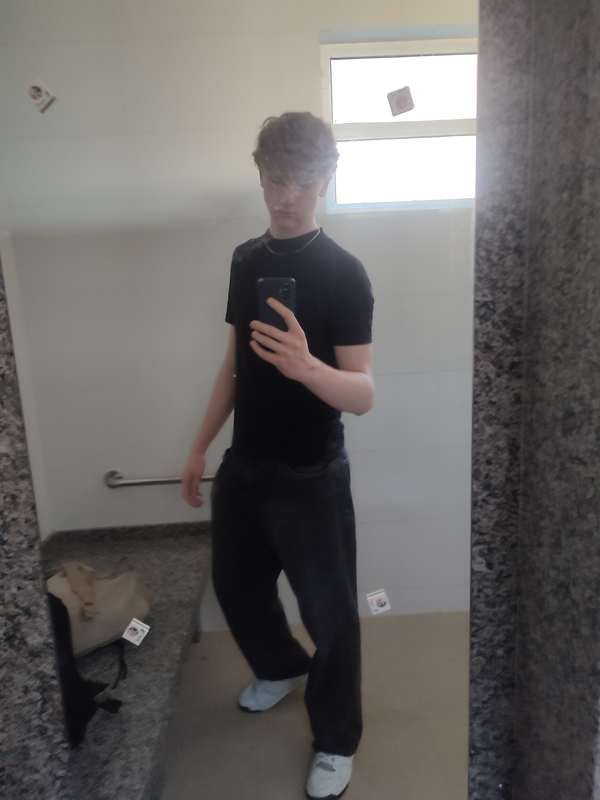
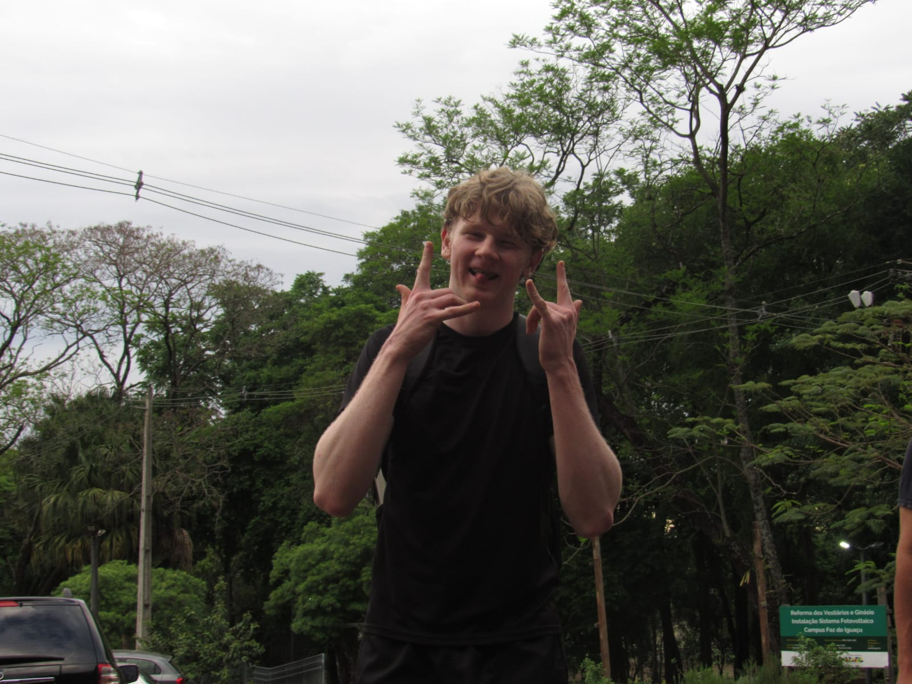

<h1 style="font-size:2em; margin-bottom:0; border-bottom:none;">🎉 Parabéns!   Você encontrou um easter egg 🥚✨</h1>

###  Créditos  
Olá! Eu sou **Guilherme C. Wernke**, criador deste GitHub, espero que esteja gostando!
 
[@guilherm.cw](https://instagram.com/guilherm.cw)

<table>
  <tr>
    <td></td>
    <td></td>
  </tr>
  <tr>
    <td></td>
    <td></td>
  </tr>
</table>

---

### 💬 Agradecimento  
Quero agradecer a todos que contribuíram, exploraram e mantiveram vivo o espírito do **LabMaker**.  
Este projeto representa esforço, aprendizado e criatividade, e espero que as futuras gerações aprendam com esse meu material de apoio e continue inspirando outros com a cultura Maker! 💡🤖  

---

Criado em: <strong>12 de novembro de 2025</strong> 
Feito por GCW para o LabMaker

