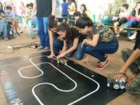
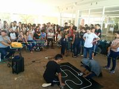
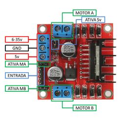

# Oficina de Robotica

Objetivo
--------

O objetivo da oficina de **Robótica** é preparar equipes de alunos para participar das competições da **Olimpíada de Robótica do IFPR**.

[](/wiki/index.php/Arquivo:Robotica2018-1.jpg)
[](/wiki/index.php/Arquivo:Robotica2018-2.jpg)

Esta oficina está voltada para a modalidade **Robótica Livre** permite que os robôs sejam construídos com materiais e componentes diversos e programados por qualquer sistema de microcontroladores, incluindo o Arduíno.

Conteúdo da oficina sobre robótica com Arduíno
----------------------------------------------

### Aula 1

[Descrição do Arduíno](arduino.md)

[Arduíno: Saídas digitais e leds](/wiki/index.php/Arduino:_Entradas_e_Saidas#Sa.C3.ADdas_digitais "Arduino: Entradas e Saidas")

[Vídeo Aula 1: Descrição do Arduíno e saídas digitais](https://drive.google.com/file/d/1RvvRnLqv-5uLYP7jwAOP_optM6iFOR0p/view?usp=sharing)

### Aula 2

[Arduíno: Entradas digitais e chaves](/wiki/index.php/Arduino:_Entradas_e_Saidas#Entradas_digitais "Arduino: Entradas e Saidas")

[Vídeo Aula 2: Arduíno: Entradas digitais e chaves](https://drive.google.com/file/d/1l2PhlgPHH8qR0RcS7NQFNGaQNdeu2CWX/view?usp=sharing)

### Aula 3

[Arduíno: Entradas analógicas](/wiki/index.php/Arduino:_Entradas_e_Saidas#Entradas_Analógicas "Arduino: Entradas e Saidas")

[Vídeo Aula 3: Arduíno: Entradas analógicas](https://drive.google.com/file/d/1FMdcj7K-qKNwQr2oUaRkblhTyMCpsfW_/view?usp=sharing)

### Aula 4

[Arduíno: Saídas analógicas](/wiki/index.php/Arduino:_Entradas_e_Saidas#Saídas_Analógicas "Arduino: Entradas e Saidas")

[Vídeo Aula 4: Arduíno: Saídas analógicas](https://drive.google.com/file/d/1o3nCXAXjwliVZnjdxDFUfVPxCy4EatIn/view?usp=sharing)

Controle dos Motores
--------------------

### Circuito Integrado L298N

O **L298N** (*[datasheet](https://www.sparkfun.com/datasheets/Robotics/L298_H_Bridge.pdf)*) é um circuito integrado **ponte H** de **maior potência**, permite controlar velocidade e direção de até 2 **motores DC** que precisem de até 3 A de corrente contínua, acionados por voltagem de até 50 volts. Ele também pode ser usado para ativar relés, motores de passo e outros.

O funcionamento do L298N (similar ao L293D) segue a seguinte **tabela verdade** (exemplo para motor A):

|  |  |  |  |
| --- | --- | --- | --- |
| **1IN** | **2IN** | **EnA** | Motor A |
| H | L | PWM1 | Sentido Horário2 |
| L | H | PWM1 | Sentido Anti-horário2 |
| L | L | X | Pára motor |
| H | H | X | Pára motor |
| X | X | L | Ponto morto |

Obs:

:   1 Velocidade controlada pelo sinal PWM,
:   2 O sentido de rotação depende também da forma de conexão dos fios nos bornes do motor.

### Módulo Ponte H L298N

Este módulo utiliza o circuito integrado L298N, oferecendo plataforma pronta para **prototipagem** para controlar até dois motores de corrente contínua ou um motor de passo e pode ser comandado por microcontroladores como o Arduíno.

[](/wiki/index.php/Arquivo:PonteH_L298N.jpg) [[1]](#cite_note-FelipeFlop-1)

A referência [FelipeFlop. Motor DC com Driver Ponte H L298N](https://www.filipeflop.com/blog/motor-dc-arduino-ponte-h-l298n/) apresenta uma descrição detalhada deste módulo e a forma de utilização com o **Arduíno**.

### Programa exemplo para teste dos motores com módulo Ponte H L298

```
//Programa para teste do motor CC com o L293D

//Definicoes pinos Arduino ligados a entrada da Ponte H
int IN1 = 2;
int IN2 = 4;
int IN3 = 7;
int IN4 = 8;
int  MA = 5;
int  MB = 6;
   
int velocidade = 200; //Velocidade do motor (0? a  255)
                      //Testar velocidade mínima para vencer inércia dos motores
   
void setup()  
{  
  //Define os pinos como saida  
  pinMode(IN1, OUTPUT);  
  pinMode(IN2, OUTPUT);  
  pinMode(IN3, OUTPUT);  
  pinMode(IN4, OUTPUT);
  pinMode(MA,  OUTPUT);  
  pinMode(MB,  OUTPUT);  
  
}  
   
void loop()  
{  
  //Configura velocidade dos motores
  analogWrite(MA, velocidade);   
  analogWrite(MB, velocidade);   
  //Aciona o motores 
  digitalWrite(IN1, LOW);  //A 
  digitalWrite(IN2, HIGH); //A
  digitalWrite(IN3, LOW);  //B
  digitalWrite(IN4, HIGH); //B 
  delay(1000);  
  //Pára motores  
  digitalWrite(IN1, HIGH);  
  digitalWrite(IN2, HIGH);
  digitalWrite(IN3, HIGH);  
  digitalWrite(IN4, HIGH);  
  delay(1000);  
  //Aciona o motores no sentido inverso  
  digitalWrite(IN1, HIGH); //A  
  digitalWrite(IN2, LOW);  //A  
  digitalWrite(IN3, HIGH); //B 
  digitalWrite(IN4, LOW);  //B  
  delay(1000);  
  //Pára motores  
  digitalWrite(IN1, HIGH);  
  digitalWrite(IN2, HIGH);
  digitalWrite(IN3, HIGH);  
  digitalWrite(IN4, HIGH);  
  delay(1000);
}
```

Sensor de Linha Infra Vermelho
------------------------------

### Teste do sensor Infra Vermelho

```
//Arduino Sensor Infra Red
int sensor = 0;  
int leitura = 0;  
 
void setup() 
{ 
    pinMode(sensor, INPUT);   
    Serial.begin(9600);
} 
 
void loop() 
{ 
  leitura = analogRead(sensor);
  Serial.print("Leitura: ");
  Serial.println(leitura);
  Serial.println();  
  delay(1000);
}
```

Programa Seguidor de Linha 2022
-------------------------------

Ponte H
:   Módulo L298D

```
//Componentes: Ponte H L298D e sensor InfraRed
//Programador: Evandro Cantu
 
//Veriáveis para sensores de linha e velocidade
int     sensorEsq, sensorLinha, sensorDir;
int     velMin = 120, velMed = 180, velMax = 240; //Velocidades dos motores
int     limiar = 400; //limiar do sensor de luz

//Variáveis para sensores de início e fim de pista
int     sensorFim;
int     contaFim = 4; //Conta marcas de início, fim e cruzamentos
boolean flagFim = false; 
long    tempoTotal; //Tempo total da volta
long    tempoExtra = 2000; //Tempo extra para seguir linha

//Definicoes pinos Arduino ligados a entrada da Ponte H
int IN1 = 2;
int IN2 = 4;
int IN3 = 7;
int IN4 = 8;
int  MA = 5; //Motor direito
int  MB = 6; //Motor esquerdo

void setup(){
  
  //Define os pinos como saida  
  pinMode(IN1, OUTPUT);  
  pinMode(IN2, OUTPUT);  
  pinMode(IN3, OUTPUT);  
  pinMode(IN4, OUTPUT);
  pinMode(MA,  OUTPUT);  
  pinMode(MB,  OUTPUT);  
  
}

void para_frente(int vel) {
  //Configura velocidade dos motores
  analogWrite(MA, vel);   
  analogWrite(MB, vel);   
  //Aciona o motores 
  digitalWrite(IN1, LOW);  //A 
  digitalWrite(IN2, HIGH); //A
  digitalWrite(IN3, LOW);  //B
  digitalWrite(IN4, HIGH); //B   
}

void vira_esquerda(int vel) {
  //MotorA_frente
  analogWrite(MA, vel);
  digitalWrite(IN1, LOW);  //A 
  digitalWrite(IN2, HIGH); //A  
  //MotorB_tras 
  analogWrite(MB, vel);   
  digitalWrite(IN3, HIGH); //B
  digitalWrite(IN4, LOW);  //B   
}

void vira_direita(int vel) {
  //MotorA_tras
  analogWrite(MA, vel);
  digitalWrite(IN1, HIGH);  //A 
  digitalWrite(IN2, LOW); //A  
  //MotorB_frente 
  analogWrite(MB, vel);   
  digitalWrite(IN3, LOW); //B
  digitalWrite(IN4, HIGH);  //B   
}

void para_motores() {
  //MotorA_para
  digitalWrite(IN1, HIGH);  //A 
  digitalWrite(IN2, HIGH);  //A  
  //MotorB_para 
  digitalWrite(IN3, HIGH);  //B
  digitalWrite(IN4, HIGH);  //B   
}

void segueLinha(){      

  //le os sensores
  sensorDir   = analogRead(2); 
  sensorLinha = analogRead(1);
  sensorEsq   = analogRead(0);
  //sensorFim   = analogRead(3);

  //Se estiver na linha segue em frente 
  if (sensorLinha < limiar){
    para_frente(velMax);    
  }
 
  //Se sensorDir acha linha vire para a direita
  if (sensorDir < limiar && sensorLinha > limiar){
    vira_direita(velMed);
  }
 
  //Se sensorEsq acha linha vire para a esquerda
  if (sensorEsq < limiar && sensorLinha > limiar){
    vira_esquerda(velMed);
  }

}
 
void loop(){
  //Segue linha até encontrar marca de fim de pista
  while(contFim > 0){
    segueLinha();
    if (sensorFim < limiar)
       flagFim = true; 
    if (sensorFim > limiar && flagFim == true){
       flagFim=false;
       contFim--;
    }
  }

 //Segue linha por mais 2 segundos antes de parar
 tempoTotal = millis();
 while((millis() - tempoTotal) < tempoExtra)
   segueLinha();

 //Pára motores
 para_motores();

 //Espera 10s
 delay(10000);
 }
```

Referências
-----------

1. [↑](#cite_ref-FelipeFlop_1-0)  FelipeFlop. Motor DC com Driver Ponte H L298N, 2013. <https://www.filipeflop.com/blog/motor-dc-arduino-ponte-h-l298n/>
