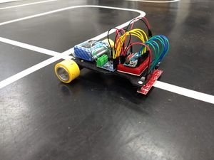
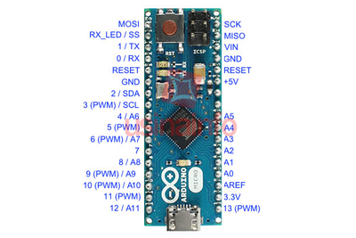
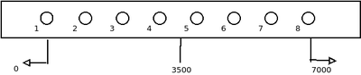

# Seguidor de Linha com controle PID

Teoria sobre Sistemas de Controle PID
-------------------------------------

[Sistemas de Controle](sistemas_de_controles.md)
:   Um resumo da teoria sobre **Sistemas de Controle em Malha Fechada** e do **Controle Proporcional Integral Derivativo**.

Ações de Controle PID sobre o Seguidor de Linha
-----------------------------------------------

[Ações de Controle PID sobre o Seguidor de Linha](a_es_de_controle_pid_sobre_o_seguidor_de_linha.md)
:   Descrição das ações de Controle PID sobre o Seguidor de Linha, hipóteses e problemas a serem experimentados.

Controle de velocidade de robô Seguidor de Linha
------------------------------------------------

Um robô Seguidor de Linha equipado com dois motores de **corrente contínua**, os quais tem seu **controle de velocidade** e **sentido de rotação** a partir de **tensão elétrica** variável aplicada em seus terminais:

* **Sentido de rotação**: Tensão positiva gira em um sentido e tensão negativa em outro sentido;
* **Velocidade**: Controlada pela amplitude da tensão aplicada.

Arduíno e Ponte H
:   O **Arduíno** equipado com um módulo **Ponte H** permite o controle de motores de corrente contínua através de **saídas digitais e analógicas**:

1. O **sentido de rotação** dos motores é realizado a partir de **saídas digitais**, com LOW para um sentido e HIGH para o outro.
2. O **controle da velocidade** dos motores é realizado a partir de **"saídas analógicas"**, com **modulação PWM** de 8 bits, correspondendo a valores decimais entre O e 255. Estes valores correspondem a faixa entre 0 V e 5 V em caso de tensão nominal de 5 V.

:   Entretanto, dependendo dos motores, a faixa de ajuste da velocidades geralmente varia de **valorMínimo** a **255**, onde o valorMínimo é a modulação PWM mínima para romper a inércia dos motores (algo entre 60 e 80, dependendo do tipo de motores e do peso do robô).

Funcionamento do Seguidor de Linha e a ação do Controle

1. Suponha que um **Seguidor de Linha** seja programado para percorrer a pista com uma **velocidade normal** estabelecida com a modulação PWM **velNormal = 120** e que tenhamos somente o **controle proporcional** ativo, com **Kp = 20**.
2. Suponha que em dado momento tenhamos **erro = 1**, com o robô derivando para esquerda.

:   Neste caso, a ação do controle proporcional modificará a trajetória do robô aumentando a velocidade do motor esquerdo e diminuindo a velocidade do motor direito:

```
velMotorEsq = velNormal + Kp * erro = 120 + 20 * 1 = 140
velMotorDir = velNormal - Kp * erro = 120 - 20 * 1 = 100
```

Ajuste dos parâmetros PID
:   O projeto apresentado em utiliza motores de passo também controlados por modulação PWM. O autor sugere iniciar com **Kp = 25**, com **Ki = 0** e **Kd = 0**.

    * Experimentalmente foi aumentando o valor de **Kp** de forma que o robô continuasse a seguir linha de forma **estável**. O autor chegou a um valor de **Kp** = 50 após testes.
    * Posteriormente, ajustou novo valor para **Kp** e **Kd** para **1/2 Kp** utilizado com o controle proporcional único e prosseguiu com novos testes.
    * O autor não implementou o controle **Ki**.

Hardware do Robô Seguidor de Linha
----------------------------------

O **hardware** do **Robô Seguidor de Linha com Controle** PID possui como módulos principais um **Arduíno Micro**, um **vetor de sensores de reflectância QTR-8**, um **drive para motores DC L9110** e um **regulador de tensão**.

[]

### Arduíno Micro

[]

### Vetor de sensores QTR-8

O **vetor de sensores de reflectância QTR-8** possui **8 leds IR/fototransistores** (emissores infravermelho/receptores) montados em uma única placa, projetado para ser utilizado em **seguidores de linha**.

Há dois tipos de sensores **QTR-8**:

* [QTR-8A](https://www.pololu.com/product/960): Utiliza leitura analógica dos sensores
* [QTR-8RC](https://www.pololu.com/product/961): Utiliza portas digitais para fazer leitura dos sensores

Biblioteca para Arduíno
:   [Arduino Library for the Pololu QTR Reflectance Sensors](https://www.pololu.com/docs/0J19)

Leitura dos sensores
:   O programa utiliza uma função disponível na **biblioteca QTR-8** que fornece a **posição** do vetor em relação a linha, variando de 0 a 7000 (sensor 1 até sensor 8). Com o vetor no centro da linha retorna o valor 3500.

[]

:   Cálculo do erro:

```
erro = (posição - 3500)/1000 => -3,5 =< erro =< +3,5
```

### Drive para Motor DC L9110

[Driver L9110](http://me.web2.ncut.edu.tw/ezfiles/39/1039/img/617/L9110_2_CHANNEL_MOTOR_DRIVER.pdf)

Exemplo de uso:

* [How-to-use-the-L9110](https://www.bananarobotics.com/shop/How-to-use-the-HG7881-(L9110)-Dual-Channel-Motor-Driver-Module)

Outros protótipos de hardware testados
--------------------------------------

### Ajuste de parâmetros via Bluetooth

Para facilitar o ajuste dos parâmetros, foi introduzido um módulo bluetooth no robô para que os parâmetros sejam transferidos via Bluetooth de um aplicativo em um celular Android.

O aplicativo foi desenvolvido com o [App Inventor](http://ai2.appinventor.mit.edu).

A comunicação usando Bluetooth foi construída baseado nos exemplos apresentados em:

* <https://appinventor.pevest.com/2015/01/23/part-1-basic-bluetooth-communications-using-app-inventor/>
* <https://appinventor.pevest.com/2017/01/06/part-3-bluetooth-communications-with-2-arduino-devices-using-app-inventor/>

### Vetor de Sensores e Determinação do Erro

A primeira versão do **Seguidor de Linha** utilizava um **vetor com sete sensores** para seguir a linha e determinar o **erro** do robô em relação a linha.

Dependendo da posição do vetor sobre a linha, **apenas um** ou **dois sensores** podem reconhecer a linha ao mesmo tempo, como mostra as figuras abaixo:

(./img/300px-VetorSensores1.png)

:   Apenas sensor central (s3) reconhece a linha.

(./img/300px-VetorSensores2.png)

:   Sensor central (s3) e sensor (s4) reconhecem a linha.

Possibilidades para o vetor de sensores
:   Quando o sensor central está sobre a linha o erro é zero.
:   Quando o carrinho deriva para esquerda, sensibilizando os sensores a direita do ponto central, o erro é positivo. Quando deriva para direita, sensibilizando os sensores a esquerda do ponto central, o erro é negativo.

```
  Sensores
0 1 2 3 4 5 6  
-------------
1 0 0 0 0 0 0  --> Erro -6
1 1 0 0 0 0 0  --> Erro -5
0 1 0 0 0 0 0  --> Erro -4
0 1 1 0 0 0 0  --> Erro -3
0 0 1 0 0 0 0  --> Erro -2
0 0 1 1 0 0 0  --> Erro -1
0 0 0 1 0 0 0  --> Erro  0
0 0 0 1 1 0 0  --> Erro  1
0 0 0 0 1 0 0  --> Erro  2
0 0 0 0 1 1 0  --> Erro  3
0 0 0 0 0 1 0  --> Erro  4
0 0 0 0 0 1 1  --> Erro  5
0 0 0 0 0 0 1  --> Erro  6
```

Materiais sobre Seguidor de Linha com controle PID
--------------------------------------------------

Projetos

* <http://labdegaragem.com/profiles/blogs/tutorial-rob-seguidor-de-linha-com-controle-pid-e-ajustes-por>
* <http://www.roboliv.re/conteudo/pid-controle-proporcional-integral-derivativo>
* <http://www.andrix.com.br/robo-seguidor-de-linha-utilizando-um-controlador-proporcional-derivativo-pd-com-arduino/>
* <http://www.andrix.com.br/robo-seguidor-de-linha-utilizando-um-controlador-proporcional-derivativo-pd-com-arduino/>
* <https://www.instructables.com/id/PID-Based-Line-Following-Robot-With-POLALU-QTR-8RC/>

Artigos e TCCs

* <http://www2.uesb.br/computacao/wp-content/uploads/2014/09/ROB%C3%94-SEGUIDOR-DE-LINHA-AUT%C3%94NOMO-UTILIZANDO-O-CONTROLADOR-PROPORCIONAL-DERIVATIVO-EM-UMA-PLATAFORMA-DE-HARDWARE-SOFTWARE-LIVRE.pdf>
* <http://sistemaolimpo.org/midias/uploads/230c61ca8833329f9ffc867a89566dcd.pdf>
* <http://sistemaolimpo.org/midias/uploads/576de7878a7614e9d80c2907103fc4c7.pdf>
* <http://repositorio.roca.utfpr.edu.br/jspui/bitstream/1/7105/1/PB_COENC_2016_1_04.pdf>

Referências
-----------

1. <http://labdegaragem.com/profiles/blogs/tutorial-rob-seguidor-de-linha-com-controle-pid-e-ajustes-por>
